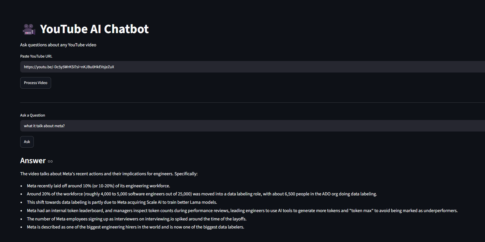

# 🎥 YouTube AI Chatbot using RAG

An AI-powered chatbot that allows users to ask questions about any YouTube video using **Retrieval-Augmented Generation (RAG)**. The application extracts the video's transcript, converts it into embeddings, stores them in a FAISS vector database, retrieves the most relevant context using **Maximum Marginal Relevance (MMR)**, and generates accurate answers using **Google Gemini 2.5 Flash**.

---

🚀 Features

- 🎥 Extracts transcripts from YouTube videos
- ✂️ Recursive Character Text Splitting
- 🧠 Gemini Embedding-001 for semantic embeddings
- 📚 FAISS Vector Database
- 🔍 Maximum Marginal Relevance (MMR) Retrieval
- 🤖 Gemini 2.5 Flash for answer generation
- 💬 Interactive Streamlit interface

---

 🛠️ Tech Stack

- Python
- Streamlit
- LangChain
- Google Gemini 2.5 Flash
- Gemini Embedding-001
- FAISS
- YouTube Transcript API

---

 📂 Project Structure

```text
youtube_chatbot/
│
├── assets/
│   └── demo.png
│
├── src/
│   ├── __init__.py
│   ├── transcript.py
│   ├── text_splitter.py
│   ├── vector_store.py
│   ├── retriever.py
│   ├── prompt.py
│   └── chatbot.py
│
├── app.py
├── requirements.txt
├── README.md
├── .gitignore
└── .env
```

---

🚀 Installation

Clone the repository

```bash
git clone https://github.com/yourusername/youtube-ai-chatbot.git
cd youtube-ai-chatbot
```

Install dependencies

```bash
pip install -r requirements.txt
```

Create a `.env` file in the project root

```env
GOOGLE_API_KEY=YOUR_GEMINI_API_KEY
```

Run the application

```bash
streamlit run app.py
```

---

🔄 RAG Pipeline

```text
YouTube URL
      │
      ▼
Extract Transcript
      │
      ▼
Text Splitting
      │
      ▼
Gemini Embedding-001
      │
      ▼
FAISS Vector Store
      │
      ▼
MMR Retriever
      │
      ▼
Prompt Template
      │
      ▼
Gemini 2.5 Flash
      │
      ▼
Generated Answer
```

---

📸 Application Demo



---

---

 💡 Future Improvements

- Chat History
- Multi-Video Support
- Voice Input
- PDF Export
- Multi-language Support
- Conversation Memory
- Persistent FAISS Index

---

👨‍💻 Author

Gyaneshwar Kumar

- GitHub: https://github.com/gyaneshwar07
- LinkedIn: https://www.linkedin.com/in/gyaneshwar-kumar-7744472a3/

---
Note: Due to YouTube restrictions on cloud-hosted IP addresses, the application is intended to run locally. It works correctly in a local environment.

⭐ If you found this project helpful, consider giving it a star!
